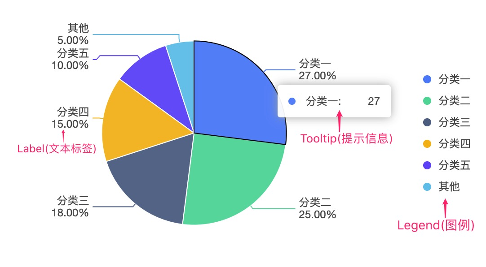
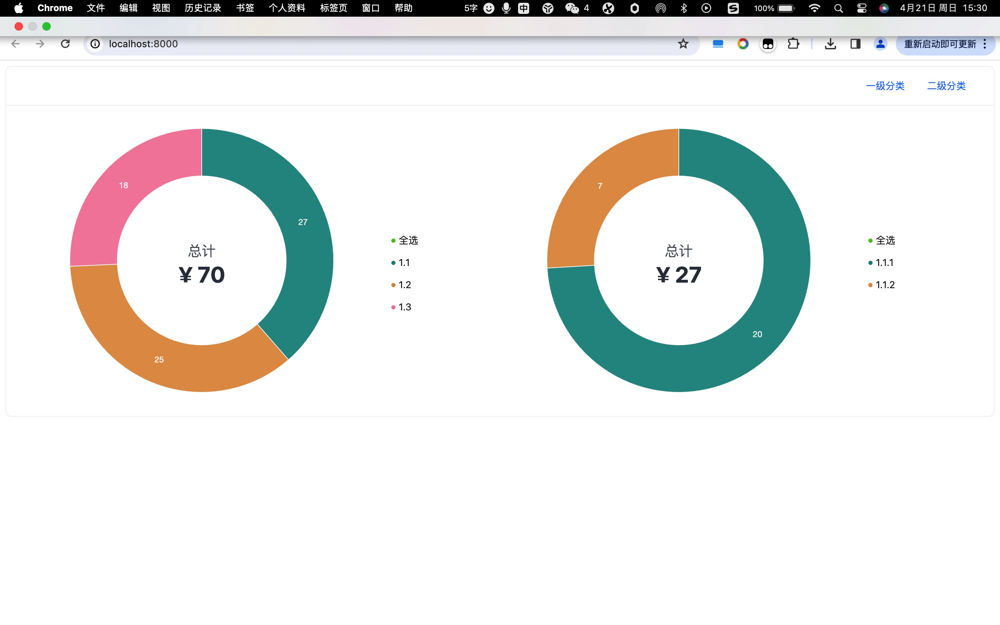

# umi project

## Getting Started

Install dependencies,

```bash
$ yarn
```

Start the dev server,

```bash
$ yarn start
```
# antvlegendCustom
1）该demo实现了antv中自定义图例，原因发现图例(legend)没有点击事件，但是图例旁边的icon图有点击事件。所以自定义写了一个图例


2）该demo，同时实现了点击左侧图表的图例，右侧图例也会联动的效果
