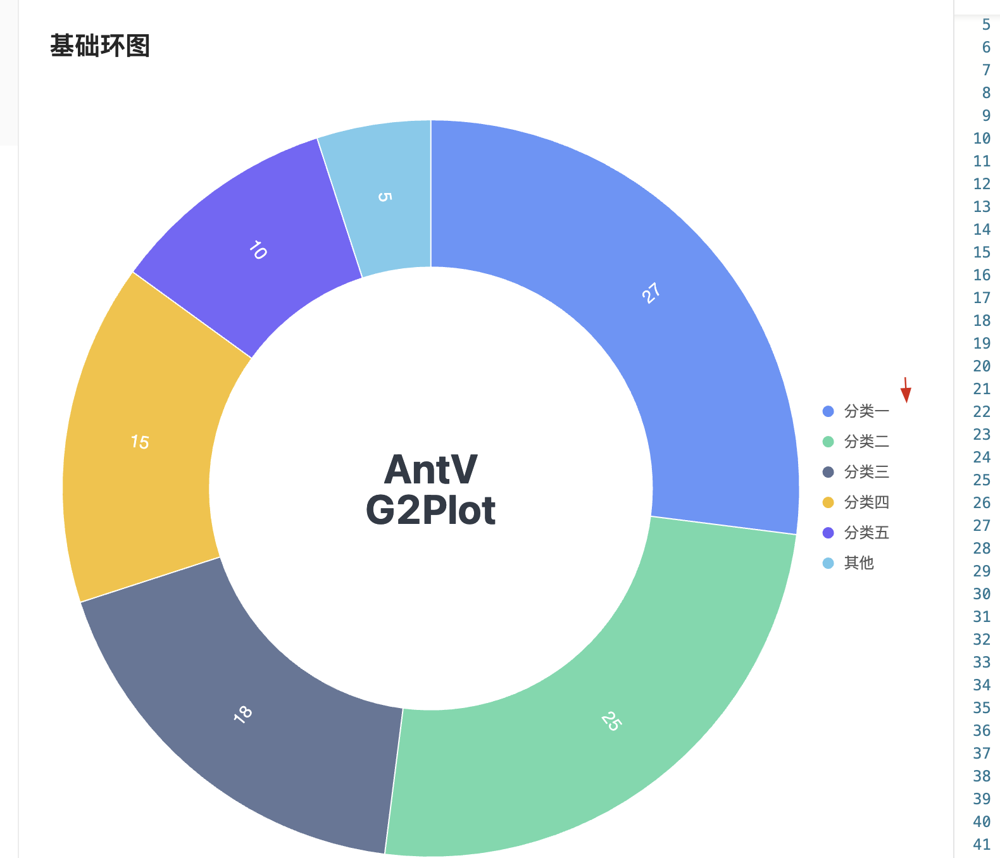

# umi project

## Getting Started

Install dependencies,

```bash
$ yarn
```

Start the dev server,

```bash
$ yarn start
```
# antvlegendCustom
# 该demo实现了antv中自定义图例，原因发现图例没有点击事件，是有图例旁边的icon图有点点击事件。所以自定义写了一个

